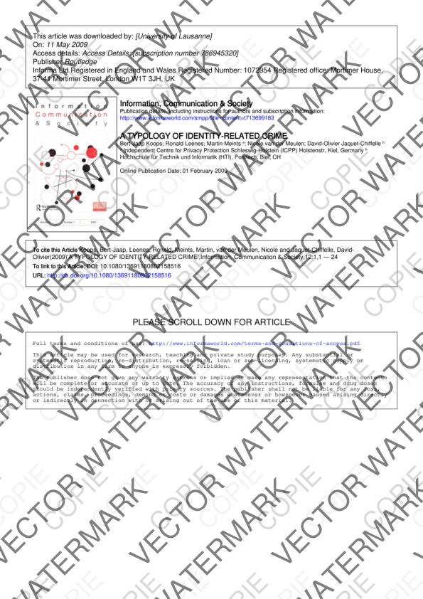

# Privacy Watermarking App on macOS

A macOS application for watermarking documents and maintaining control over your important files (e.g. passport, ID sent for an online application). It also ensures all EXIF Metadata is stripped from the output file.

## Features

- **Customizable watermark**: text, opacity, size, spacing, color
- **Configurable orientation**: ascending (↗) or descending (↘)
- **Dynamic Export Formats**:
  - **From Images (JPG/PNG)**: Export as **JPG**, **PNG** (lossless), or **PDF** (single-page).
  - **From PDFs**: Export as **PDF** (Vector or Secure), **Images (JPG)**, or **Images (PNG)**.
- **Secure Mode**: high-definition rasterization (300/450/600 DPI) making the watermark impossible to remove
- **Real-time preview**: instant preview of changes

## Application UI Walkthrough


https://github.com/user-attachments/assets/15e39e6a-2b2e-4cb9-b6ea-c865e61e36b5


## Secure Mode (Raster) for PDF Files

**Secure Mode** converts each PDF page into a high-resolution image before applying the watermark. This makes the watermark inseparable from the content and prevents any attempt at removal or text extraction.


| Vector Mode (Standard) | Secure Mode (Raster) |
|:-------------------------:|:----------------------:|
|  |  |
| **Selectable text**: The watermark is a text layer on top of the PDF. | **Flattened image**: The watermark is merged with the document pixels. |
| **Removal**: Possible with PDF editing tools. | **Removal**: Impossible without visibly damaging the image. |
| **Text search**: The watermark is technically detectable. | **Text search**: The watermark is invisible to algorithms (0 text found). |
| **File size**: Very light. | **File size**: Larger (300+ DPI). |


## Installation

### From releases (Recommended)

1. Download `Passport-Filigrane.zip` (or the compressed folder) from the [Releases](https://github.com/Louni-M/Passport-Filigrane/releases)
2. Extract the archive
3. Drag `Passport Filigrane.app` into your **Applications** folder
4. Launch the application (Note: On first launch, a right-click > Open may be required as the app is not yet signed with an Apple developer certificate).

### From source

```bash
# Clone the repo
git clone https://github.com/Louni-M/Passport-Filigrane.git
cd Passport-Filigrane

# Create a virtual environment
python3 -m venv venv
source venv/bin/activate

# Install dependencies
pip install -r requirements.txt

# Run the application
python main.py
```

### Building the application (Developers)

```bash
# The build uses onedir mode for optimal performance
pyinstaller "Passport Filigrane.spec" --clean
```

The application is generated in `dist/Passport Filigrane.app`.

## Project Structure

```
Passport-Filigrane/
├── main.py              # Main application (Flet UI)
├── pdf_processing.py    # Watermarking engine (PyMuPDF/Pillow)
├── assets/              # Resources (Icons)
├── tests/               # Unit and integration tests
├── SECURITY.md          # Security policy
└── Passport Filigrane.spec # PyInstaller build configuration
```

## License

Personal project - Free to use for personal and non-commercial purposes.

## Author

Louni Merk - 2026
