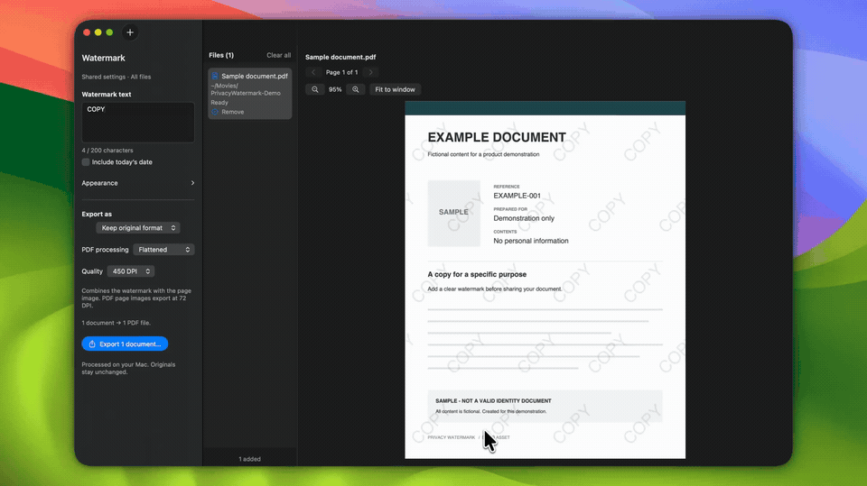

# Product demo

Recorded and edited by the maintainer in Recordly on 2026-09-12 using a fictional sample document.

- `privacy-watermark.mp4`: full 21.77-second demo, H.264, 1920 × 1078, 30 fps, no audio. Re-encoded from the original export for web delivery; timing and effects are preserved.
- `preview.gif`: looping eight-second excerpt starting at 00:04, 720 pixels wide at 12 fps with a 96-color palette (1.14 MB).
- `full-demo.gif`: complete demo, 960 pixels wide at 20 fps with a 192-color palette. The dedicated demo page plays this automatically; the main README loads only the lightweight preview.
- `poster.jpg`: still from the finished demo.

The recording demonstrates appearance adjustments and output-format selection. The original-quality export, raw recording, cursor data and editable Recordly project are retained locally, outside the repository.
